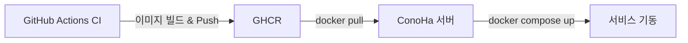

# 프로덕션 배포 가이드

> **대상 서버:** ConoHa VPS  
> **배포 방식:** GHCR 이미지 Pull → Docker Compose 실행

## 배포 아키텍처



```
GitHub Push → CI 빌드 → GHCR에 이미지 Push
                              ↓
ConoHa 서버에서 ./deploy.sh 실행
  1. GHCR에서 최신 이미지 Pull (frontend, backend, nginx)
  2. 기존 컨테이너 종료 → 새 컨테이너 기동
  3. 백엔드 헬스체크 대기 (최대 60초)
  4. 구버전 이미지 정리
```

> **GHCR (GitHub Container Registry)** 는 GitHub에서 제공하는 Docker 이미지 저장소입니다.
> `ci.yml` 워크플로우가 `main` 브랜치에 Push될 때마다 이미지를 자동으로 빌드 → Push합니다.

## GHCR 이미지 목록

CI가 빌드하여 Push하는 이미지:

| 이미지 | 서비스 | 설명 |
|--------|--------|------|
| `ghcr.io/cnjw2021/ninestar-compact-frontend:latest` | Next.js 프론트엔드 | SSR 렌더링, 정적 자산 서빙 |
| `ghcr.io/cnjw2021/ninestar-compact-backend:latest` | Flask 백엔드 + rq-worker | REST API 제공, Gunicorn으로 멀티워커 실행 |
| `ghcr.io/cnjw2021/ninestar-compact-nginx:latest` | Nginx 리버스 프록시 | SSL 종단, frontend/backend로 요청 라우팅 |

그 외 서비스는 공개 이미지를 사용합니다:
- `mysql:8.0` — 메인 데이터 저장소 (구성·점괘 데이터)
- `redis:7-alpine` — RQ(Redis Queue) 작업 큐 브로커
- `certbot/certbot` — Let's Encrypt SSL 인증서 자동 갱신
- `newrelic/infrastructure:latest` — 서버 모니터링 에이전트

---

## 서버 필수 파일

배포 전, 서버에 아래 파일/디렉토리가 존재해야 합니다:

```
/서버/배포경로/
├── docker-compose.prod.yml     # 서비스 정의 (GHCR 이미지 기반 — build 대신 image 사용)
├── deploy.sh                   # 배포 스크립트 (pull → 재시작 → 헬스체크 → 정리)
├── .env.production.backend     # 백엔드 환경변수 (DB 접속정보, 시크릿 키 등)
├── .env.production.frontend    # 프론트엔드 환경변수 (API URL 등)
├── nginx/
│   └── conf.d/                 # Nginx 설정 파일 (server 블록, upstream 정의)
├── certbot/
│   ├── conf/                   # SSL 인증서 (Let's Encrypt에서 발급)
│   └── www/                    # ACME challenge 디렉토리 (인증서 발급/갱신 시 사용)
└── mysql/
    └── init/                   # DB 초기화 SQL (최초 배포 시 docker-entrypoint-initdb.d로 마운트)
```

> **참고:** `mysql/init/`은 MySQL 컨테이너가 **최초 기동**될 때만 실행됩니다.
> 이미 `mysql_data` 볼륨이 존재하면 init 스크립트는 무시됩니다.

### 환경변수 파일 내용

#### `.env.production.backend`
```env
# 데이터베이스
DB_ROOT_PASSWORD=<루트 비밀번호>        # MySQL root 계정 비밀번호 (docker-compose에서 MYSQL_ROOT_PASSWORD로 전달)
DB_NAME=ninestarki                      # 기본 데이터베이스명
DB_USER=<DB 사용자명>                   # 애플리케이션용 MySQL 사용자
DB_PASSWORD=<DB 비밀번호>               # 애플리케이션용 MySQL 비밀번호
DB_HOST=mysql                           # Docker 네트워크 내부의 서비스명 (컨테이너명이 아님)
DB_PORT=3306
DATABASE_URL=mysql+pymysql://<DB_USER>:<DB_PASSWORD>@mysql:3306/ninestarki?charset=utf8mb4
# ⚠️ DATABASE_URL이 설정되면 DB_USER/DB_PASSWORD보다 우선됩니다 (core/db_config.py 참조)

# 앱 시크릿
SECRET_KEY=<시크릿 키>                  # Flask 세션 암호화 키 (임의의 긴 문자열)
JWT_SECRET_KEY=<JWT 시크릿 키>          # JWT 토큰 서명 키

# 슈퍼유저 (db_manage.py init 시 자동 생성)
SUPERUSER_EMAIL=<이메일>
SUPERUSER_PASSWORD=<비밀번호>

# New Relic (선택)
NRIA_LICENSE_KEY=<라이선스 키>          # New Relic 인프라 모니터링 에이전트 키
```

#### `.env.production.frontend`
```env
# 本番環境設定
NEXT_PUBLIC_API_URL=https://<도메인>/api   # 클라이언트에서 호출하는 API 엔드포인트 (NEXT_PUBLIC_ 접두사 필수)
NEXT_PUBLIC_BASE_URL=https://<도메인>      # OG 태그, 외부 공유 링크 등의 Base URL로 사용
NODE_ENV=production                        # 빌드/실행 환경 명시
```

---

## 배포 절차

### 최초 배포 (서버 초기 설정)

```bash
# 1. GHCR 로그인
# GitHub Personal Access Token (PAT)에 read:packages 권한 필요
docker login ghcr.io -u <GITHUB_USER> -p <GITHUB_TOKEN>

# 2. 배포 디렉토리 생성 및 필수 파일 배치
mkdir -p /opt/ninestar && cd /opt/ninestar
# docker-compose.prod.yml, deploy.sh, .env 파일, nginx/conf.d/ 등 배치

# 3. 배포 실행
chmod +x deploy.sh
./deploy.sh
```

### 이후 배포 (업데이트)

```bash
cd /opt/ninestar
./deploy.sh
# deploy.sh가 자동으로: pull → down → up -d → 헬스체크 → 이미지 정리
```

### 특정 서비스만 업데이트

```bash
# 백엔드만 업데이트 (rq-worker도 같은 이미지를 사용하므로 함께 재시작)
docker pull ghcr.io/cnjw2021/ninestar-compact-backend:latest
docker compose -f docker-compose.prod.yml up -d backend rq-worker

# 프론트엔드만 업데이트
docker pull ghcr.io/cnjw2021/ninestar-compact-frontend:latest
docker compose -f docker-compose.prod.yml up -d frontend
```

---

## 트러블슈팅

### 로그 확인
```bash
# 전체 로그
docker compose -f docker-compose.prod.yml logs

# 특정 서비스 로그 (최근 100줄만)
docker compose -f docker-compose.prod.yml logs --tail 100 backend
docker compose -f docker-compose.prod.yml logs --tail 100 mysql
```

### GHCR 인증 오류
```bash
# PAT가 만료되었거나 권한이 부족한 경우 재로그인
docker logout ghcr.io
docker login ghcr.io -u <GITHUB_USER> -p <GITHUB_TOKEN>
```

### 헬스체크 실패
```bash
# 백엔드 컨테이너 상태 확인 (healthy / unhealthy / starting)
docker inspect backend-container --format='{{.State.Health.Status}}'

# DB 연결 확인 — DATABASE_URL이 올바른지 체크
docker exec backend-container python -c "from core.db_config import get_db_connection_info; print(get_db_connection_info())"
```

### DB 재초기화 (⚠️ 데이터 전체 삭제!)
```bash
# mysql_data 볼륨을 삭제하면 mysql/init/ 스크립트가 다시 실행됩니다
docker compose -f docker-compose.prod.yml down
docker volume rm ninestar-compact_mysql_data
docker compose -f docker-compose.prod.yml up -d
```
