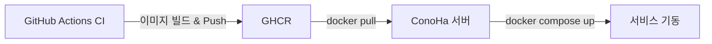

# 프로덕션 배포 가이드

> **대상 서버:** ConoHa VPS  
> **배포 방식:** GHCR 이미지 Pull → Docker Compose 실행

## 배포 아키텍처



```
GitHub Push → CI 빌드 → GHCR에 이미지 Push
                              ↓
ConoHa 서버에서 ./deploy.sh 실행
  1. GHCR에서 최신 이미지 Pull (frontend, backend, nginx)
  2. 기존 컨테이너 종료 → 새 컨테이너 기동
  3. 백엔드 헬스체크 대기 (최대 60초)
  4. 구버전 이미지 정리
```

## GHCR 이미지 목록

CI가 빌드하여 Push하는 이미지:

| 이미지 | 서비스 |
|--------|--------|
| `ghcr.io/cnjw2021/ninestar-compact-frontend:latest` | Next.js 프론트엔드 |
| `ghcr.io/cnjw2021/ninestar-compact-backend:latest` | Flask 백엔드 + rq-worker |
| `ghcr.io/cnjw2021/ninestar-compact-nginx:latest` | Nginx 리버스 프록시 |

그 외 서비스는 공개 이미지를 사용합니다:
- `mysql:8.0`, `redis:7-alpine`, `certbot/certbot`, `newrelic/infrastructure:latest`

---

## 서버 필수 파일

배포 전, 서버에 아래 파일/디렉토리가 존재해야 합니다:

```
/서버/배포경로/
├── docker-compose.prod.yml     # 서비스 정의 (GHCR 이미지 기반)
├── deploy.sh                   # 배포 스크립트
├── .env.production.backend     # 백엔드 환경변수
├── .env.production.frontend    # 프론트엔드 환경변수
├── nginx/
│   └── conf.d/                 # Nginx 설정 파일
├── certbot/
│   ├── conf/                   # SSL 인증서 (Let's Encrypt)
│   └── www/                    # ACME challenge 디렉토리
└── mysql/
    └── init/                   # DB 초기화 SQL (최초 배포 시만 필요)
```

### 환경변수 파일 내용

#### `.env.production.backend`
```env
# 데이터베이스
DB_ROOT_PASSWORD=<루트 비밀번호>
DB_NAME=ninestarki
DB_USER=<DB 사용자명>
DB_PASSWORD=<DB 비밀번호>
DB_HOST=mysql
DB_PORT=3306
DATABASE_URL=mysql+pymysql://<DB_USER>:<DB_PASSWORD>@mysql:3306/ninestarki?charset=utf8mb4

# 앱 시크릿
SECRET_KEY=<시크릿 키>
JWT_SECRET_KEY=<JWT 시크릿 키>

# 슈퍼유저
SUPERUSER_EMAIL=<이메일>
SUPERUSER_PASSWORD=<비밀번호>

# New Relic (선택)
NRIA_LICENSE_KEY=<라이선스 키>
```

#### `.env.production.frontend`
```env
NEXT_PUBLIC_API_URL=https://<도메인>/api
```

---

## 배포 절차

### 최초 배포 (서버 초기 설정)

```bash
# 1. GHCR 로그인
docker login ghcr.io -u <GITHUB_USER> -p <GITHUB_TOKEN>

# 2. 배포 디렉토리 생성 및 필수 파일 배치
mkdir -p /opt/ninestar && cd /opt/ninestar
# docker-compose.prod.yml, deploy.sh, .env 파일, nginx/conf.d/ 등 배치

# 3. 배포 실행
chmod +x deploy.sh
./deploy.sh
```

### 이후 배포 (업데이트)

```bash
cd /opt/ninestar
./deploy.sh
```

### 특정 서비스만 업데이트

```bash
# 백엔드만 업데이트
docker pull ghcr.io/cnjw2021/ninestar-compact-backend:latest
docker compose -f docker-compose.prod.yml up -d backend rq-worker

# 프론트엔드만 업데이트
docker pull ghcr.io/cnjw2021/ninestar-compact-frontend:latest
docker compose -f docker-compose.prod.yml up -d frontend
```

---

## 트러블슈팅

### 로그 확인
```bash
# 전체 로그
docker compose -f docker-compose.prod.yml logs

# 특정 서비스 로그
docker compose -f docker-compose.prod.yml logs backend
docker compose -f docker-compose.prod.yml logs mysql
```

### GHCR 인증 오류
```bash
# 토큰 갱신
docker logout ghcr.io
docker login ghcr.io -u <GITHUB_USER> -p <GITHUB_TOKEN>
```

### 헬스체크 실패
```bash
# 백엔드 컨테이너 상태 확인
docker inspect backend-container --format='{{.State.Health.Status}}'

# DB 연결 확인
docker exec backend-container python -c "from core.db_config import get_db_connection_info; print(get_db_connection_info())"
```

### DB 재초기화 (데이터 리셋 주의!)
```bash
# 기존 데이터 삭제 후 재생성
docker compose -f docker-compose.prod.yml down
docker volume rm ninestar-compact_mysql_data
docker compose -f docker-compose.prod.yml up -d
```
